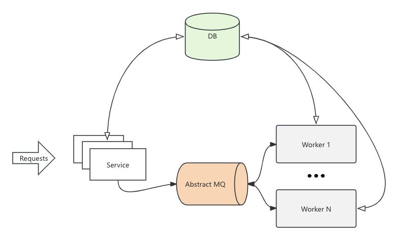

<h1 align="center">go-fsm</h1>
<h3 align="center">The Finite State Machine Development Framework Implemented in Go</h3>

#### [中文](README_Chinese.md) | English

## Introduction

go-fsm is a distributed state machine development framework. Its core feature is automated state transitions, helping developers more easily create applications that need to complete distributed transactions.

This project is `safe and reliable`, based on my successful practices in various financial business scenarios.

## Quick Start

Add to go.mod

```
require (
	github.com/HEUDavid/go-fsm latest
)
```

## Example

A state handler example

```go
func newHandler(task *Task[*MyData]) error {
	log.Printf("[FSM] State: %s, Task.Data: %s", task.State, _pretty(task.GetData()))

	// It may be necessary to perform some checks.
	// It may be necessary to pre-record the request to the database to ensure idempotency.
	// For example, generating some request IDs.
	// ...

	task.Data.Comment = "Modified by newHandler" // Update Data
	task.State = Pay.GetName()                   // Switch to next state
	return nil
}
```

A simple payment flow: New -> Pay -> End, defined as follows

**(Note: Full Demo project [here](https://github.com/HEUDavid/go-fsm-demo))**

```go
var (
	New = GenState("New", false, newHandler)
	Pay = GenState("Pay", false, payHandler)
	End = State[*MyData]{Name: "End", IsFinal: true, Handler: nil}
)

var (
	New2Pay = GenTransition(New, Pay)
	Pay2End = GenTransition(Pay, End)
	End2End = GenTransition(End, End)
)

var PayFSM = func() FSM[*MyData] {
	fsm := GenFSM[*MyData]("PayFSM")
	fsm.RegisterState(New, Pay, End)
	fsm.RegisterTransition(New2Pay, Pay2End, End2End)
	return fsm
}()
```

Generate the state machine diagram (left) via code. Another slightly [more complex example (right)](https://github.com/HEUDavid/go-fsm/blob/main/pkg/metadata/view_test.go#L10)


```go
_ = PayFSM.Draw("pay.svg")
```

<table>
  <tr>
    <td valign="top"></td>
    <td valign="top"></td>
  </tr>
</table>

## Framework Structure

- **Adapter**: Accepts external calls (no requirements for service interface protocols), core data read/write, interface satisfies idempotency
- **Worker**: MQ message-driven, state handler, Worker calls are safe and reentrant



## Main Capabilities

- **Describing State Machines**:
  - Easily describe the state machine nodes and edges (state transitions). Easily draw the state machines diagram
  - State handlers: Developers only need to implement specific business logic, the framework handles message distribution, scheduling, etc.
- **Middleware Support**:
  - Data storage: MySQL, supports transactions, can be easily embedded into other businesses
  - MQ middleware: RabbitMQ, Amazon Simple Queue Service
  - Other types of middleware can be extended according to the interface
- **Generic Support**:
  - `Excellent support for Golang generics!!!` Developing business code is particularly simple and clear! Rewriting logic is also very simple!
- **Data Update Logs**: Soon...

## Main Features

- **High Concurrency**: Supports horizontal scaling
- **Strong Reliability**: Satisfies principles of idempotency, consistency, atomicity, reentrancy
- **Flexible Extension**: Flexibly extendable by implementing interfaces, freely rewrite, arbitrary logic, arbitrary components

## Applicable Scenarios

- Financial payment systems
- Securities clearing and settlement business
- Complex workflow management
- High concurrency systems requiring state management

## Reliability Statement

- **Idempotency of Interface**
  - Create: request_id unique key ensures its idempotency
  - Update: request_id unique key ensures its idempotency, and version control (optimistic lock, at the DB level so performance is very good)
- **Reliability of State Transition**
  - Interface and Worker's transitions, first get the current state, judge whether the action is in the pre-defined state transition table
  - Updates are based on version
- **Reentrancy of State Handlers**
  - Ensure idempotency when developers call other external interfaces, then the system is reentrant (safe calling)
- **Messages Be Lost (Using the Framework's MQ Component)?**
  - Ack: When the state handler returns an error, do not execute ack (execute nack if nack is not nil), waiting for the MQ server to redistribute to the queue (ttl or abnormal process...)
  - RMQ cluster is reliable, but even if messages are lost, it's okay. Messages are stateless, you can use script tools for resend or implement monitoring logic for resend (one practice is to detect state stays)
  - AWS Amazon Simple Queue Service is more reliable. See aws/sqs.go for details
- **Self-Healing**
  - For some recoverable temporary failures (e.g., network interruptions, database service restarts, RMQ service restarts, etc.), the system can automatically recover without manual intervention
  - Typically, the recovery occurs within seconds

## Contact Me

#### admin@mdavid.cn

