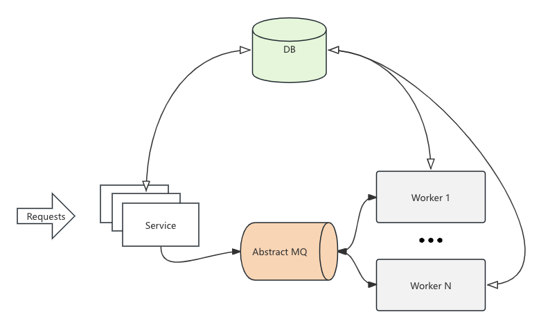

<h1 align="center">go-fsm</h1>
<h3 align="center">The Finite State Machine Development Framework Implemented in Go</h3>

## 简介

go-fsm 是一个分布式状态机开发框架，核心是自动化的状态流转，能帮助开发者更简单地开发出需要完成分布式事务的应用。

本项目`安全可靠`，是我在一些金融业务上的成功实践。

## 快速开始

go.mod 引入

```
require (
	github.com/HEUDavid/go-fsm latest
)
```

## 示例

一个状态处理器示例

```go
func newHandler(task *Task[*MyData]) error {
	log.Printf("[FSM] State: %s, Task.Data: %s", task.State, _pretty(task.GetData()))

	// It may be necessary to perform some checks.
	// It may be necessary to pre-record the request to the database to ensure idempotency.
	// For example, generating some request IDs.
	// ...

	task.Data.Comment = "Modified by newHandler" // Update Data
	task.State = Pay.GetName()                   // Switch to next state
	return nil
}
```

一个最简单的支付流程: New -> Pay -> End，其状态机定义如下

(注: 完整Demo项目[链接](https://github.com/HEUDavid/go-fsm-demo))
```go
var (
	New = GenState("New", false, newHandler)
	Pay = GenState("Pay", false, payHandler)
	End = State[*MyData]{Name: "End", IsFinal: true, Handler: nil}
)

var (
	New2Pay = GenTransition(New, Pay)
	Pay2End = GenTransition(Pay, End)
	End2End = GenTransition(End, End)
)

var PayFSM = func() FSM[*MyData] {
	fsm := GenFSM("PayFSM", New)
	fsm.RegisterState(New, Pay, End)
	fsm.RegisterTransition(New2Pay, Pay2End, End2End)
	return fsm
}()
```

通过代码可生成其状态机图(左图)，另一个[稍微复杂的示例(右图)](https://github.com/HEUDavid/go-fsm/blob/main/pkg/metadata/view_test.go#L10)

```go
_ = PayFSM.Draw("pay.svg")
```

<table>
  <tr>
    <td valign="top"></td>
    <td valign="top"></td>
  </tr>
</table>

## 框架结构

- **Adapter**: 接受外部调用(对服务接口协议没有要求)，核心数据读写，接口满足幂等性
- **Worker**: 基于MQ消息驱动，状态处理器，Worker调用安全可重入



## 主要能力

- **描述状态机**:
  - 简便描述状态机的节点和边(状态跃迁)、绘制状态机
  - 状态处理器: 开发者只需实现具体业务逻辑，框架完成消息分发、调度等
- **中间件支持**:
  - 数据存储: MySQL，支持事务，可方便地嵌入到其他业务中
  - 消息中间件: RabbitMQ、Amazon Simple Queue Service
  - 其他类型的中间件可按interface自行拓展
- **泛型支持**:
  - `对Golang的泛型支持地特别好！！！`开发业务代码特别简单，结构清晰！重写逻辑非常简单！
- **数据更新流水**: 待支持

## 主要特点

- **高并发性**: 支持水平扩展
- **可靠性强**: 满足幂等性、一致性、原子性、可重入原则
- **灵活扩展**: 可按interface灵活拓展，自由重写，任意逻辑，任意组件

## 适用场景

- 金融支付系统
- 证券清算结算业务
- 复杂工作流程管理
- 需要状态管理的高并发系统

## 可靠性说明

- **接口的幂等性**
  - Create: request_id唯一键保证其幂等性
  - Update: request_id唯一键保证其幂等性，以及version控制(乐观锁，在DB层面所以性能很好)
- **状态跃迁的可靠性**
  - 接口与Worker扭转状态，先取当前状态，判断动作是否在预先定义的状态转移表中
  - 更新基于版本号
- **状态处理器的可重入**
  - 开发者调用其他外部接口时注意幂等性，则满足系统可重入(调用安全)
- **消息会丢吗(使用框架的MQ组件)？**
  - 当状态处理器返回error时，不会执行ACK(执行NACK如果NACK不为nil)，可以配置MQ服务端重新入队
  - RMQ集群是可靠的，但万一消息丢了也无妨。消息是无状态的，可使用脚本工具运维补发，或实现监控逻辑补发(
    一个实践是对状态进行停留检测)
  - AWS Amazon Simple Queue Service，更可靠，利用删除消息和消息可见性机制实现了ACK与NACK逻辑

## 一些总结

- 如何设计一个FSM应用

## 联系我
admin@mdavid.cn
